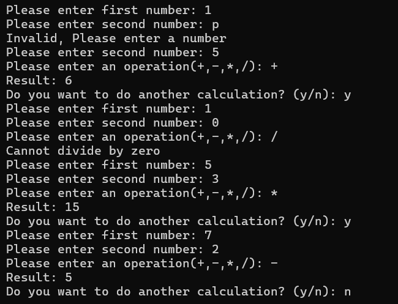

# Calculator Project

simple console application

## Features

-- Take two numbers from the user.

-- Support addition, subtraction, multiplication, and division.

-- Display the result clearly.

-- Handle division by zero and invalid input reasonably.

-- Allow the user to perform another calculation without restarting the application.

## Technology: C#

## How to Run

- Clone the repository.
- Open the solution in Visual Studio.
- Build the project.
- Run the application.

## Screenshot

